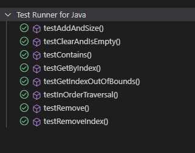

# Binary Search Tree (BST) Implementation

The project implements an efficient and functional Binary Search Tree (BST) that fulfills most basic operations of both a list and a binary tree. However, the implementation of some methods from the List interface is limited in the context of a binary search tree.


## Getting Started

These instructions will get you a copy of the project up and running on your local machine for development and testing purposes.

### Prerequisites

You need to install the following tools and configure their dependencies:

1. **Java** (version 8 or above)
    
    ```bash
    java -version
    ```

    Should return something like:
    
    ```bash
    java version "1.8.0"
    Java(TM) SE Runtime Environment (build 1.8.0-b132)
    Java HotSpot(TM) 64-Bit Server VM (build 25.0-b70, mixed mode)
    ```

2. **Maven**
    - Download Maven from [here](http://maven.apache.org/download.cgi)
    - Follow the installation instructions [here](https://maven.apache.org/install.html)

    Verify the installation:

    ```bash
    mvn -version
    ```

    Should return something like:

    ```bash
    Apache Maven 3.6.3
    ```


## Installing

1. Clone the repository and navigate into the project directory:
    
    ```bash
    git clone https://github.com/Richi025/bst.git
    cd PropertyManagement
    ```

2. Build the project:
    
    ```bash
    mvn clean package
    ```

    Should display output similar to:

    ```bash
    [INFO] BUILD SUCCESS

3. Run the application:
    
    ```bash
    java -jar target/BST-0.0.1-SNAPSHOT.jar
    ```

    

## Test Resutls

To run the tests use:

  ```bash
  mvn test
  ```




## Explanation


### 1. BinarySearchTree Class

This class is an implementation of a parameterized Binary Search Tree that extends Comparable to ensure that the elements can be compared. It implements the `List<T>` interface, allowing the tree to behave like a list, although some List operations are not directly applicable to a BST.

### 1.1. Main Methods

- **`BinarySearchTree()`**
  - **Description**: Initializes an empty binary search tree.

- **`boolean add(T value)`**
  - **Description**: Inserts an element into the tree.

- **`int size()`**
  - **Description**: Counts the total number of nodes in the tree.

- **`T get(int index)`**
  - **Description**: Retrieves the value of a node at a specific index based on an in-order traversal.

- **`boolean remove(Object o)`**
  - **Description**: Removes a node from the tree if it exists.

- **`TreeNode<T> search(T value)`**
  - **Description**: Searches for a specific element in the tree.

- **`void delete(T value)`**
  - **Description**: Deletes a specified element from the tree.

- **`void clear()`**
  - **Description**: Removes all nodes from the tree.

- **`boolean isEmpty()`**
  - **Description**: Checks if the tree is currently empty.

- **`boolean contains(Object o)`**
  - **Description**: Determines if the tree contains a specified element.

### 1.2. Auxiliary Methods

- **`void insert(T value)`**
  - **Description**: Calls the recursive method to insert an element into the tree.

- **`int countNodes()`**
  - **Description**: Counts the total number of nodes recursively.

- **`boolean addAll(Collection<? extends T> c)`**
  - **Description**: Adds all elements from a given collection to the tree.

- **`boolean containsAll(Collection<?> c)`**
  - **Description**: Checks if the tree contains all elements from a specified collection.

- **`boolean removeAll(Collection<?> c)`**
  - **Description**: Removes all elements present in the specified collection from the tree.

- **`boolean retainAll(Collection<?> c)`**
  - **Description**: Retains only the elements in the tree that exist in the specified collection.

- **`Object[] toArray()`**
  - **Description**: Returns an array containing all elements of the tree in order.

- **`Object[] toArray(Object[] a)`**
  - **Description**: Returns an array containing all elements of the tree in order, using a provided array if possible.

- **`int indexOf(Object o)`**
  - **Description**: Finds the index of a specified element in the tree.

- **`int lastIndexOf(Object o)`**
  - **Description**: Finds the last index of a specified element in the tree.

- **`Iterator<T> iterator()`**
  - **Description**: Provides an iterator for traversing the elements of the tree in order.

- **`ListIterator<T> listIterator()`**
  - **Description**: Not supported in a `BinarySearchTree`.

- **`ListIterator<T> listIterator(int index)`**
  - **Description**: Not supported in a `BinarySearchTree`.

- **`List<T> subList(int fromIndex, int toIndex)`**
  - **Description**: Returns a sublist of elements between the specified indices.

- **`T set(int index, T element)`**
  - **Description**: Not supported in a `BinarySearchTree`.

- **`void add(int index, T element)`**
  - **Description**: Not supported in a `BinarySearchTree`.

- **`T remove(int index)`**
  - **Description**: Removes the element at a specified index.

## 2. TreeNode Class

This class represents a node in the tree. Each node has three properties: the stored value (`value`), and pointers to the left (`left`) and right (`right`) children. The class is straightforward and contains only a constructor that initializes the value and sets the children to `null`.

## 3. BstApplication Class

This class contains the main method to run tests on the binary search tree. Instances of the tree are created, and various operations are performed to verify its functionality:

- **Insertions**: Inserts several values into the tree.

- **Traversals**: Displays the in-order traversal of the nodes.

- **Searches**: Checks if a specific value exists in the tree.

- **Deletions**: Removes nodes with different characteristics (leaves, nodes with one child, and nodes with two children).

- **Node Count**: Shows how many nodes remain in the tree after deletions.

- **Tree Cleanup**: Clears all nodes and reinserts some values to demonstrate that the tree can be reused.

- **Indices**: Illustrates how to access specific elements by index after sorting them through an in-order traversal.


## Built With

- [Maven](https://maven.apache.org/) - Dependency Management
- [Spring Boot](https://spring.io/projects/spring-boot) - Framework for building microservices

## Versioned

We use [Git](https://github.com/) for version control. For available versions, see the tags in this repository.

## Author

* **Jose Ricardo Vasquez Vega** - [Richi025](https://github.com/Richi025)

## Date

October 17, 2024